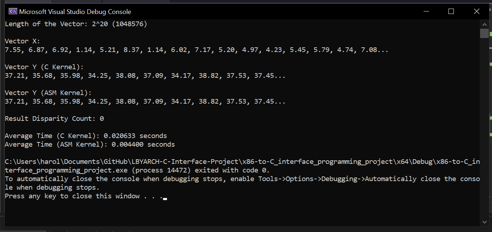
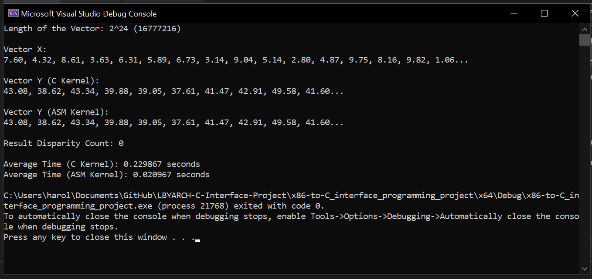
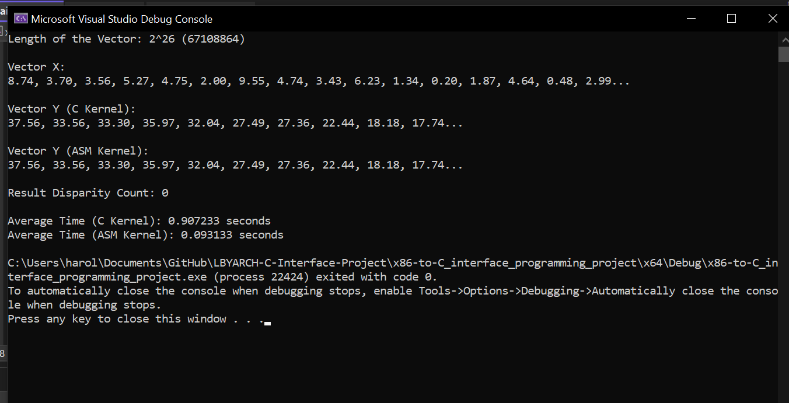
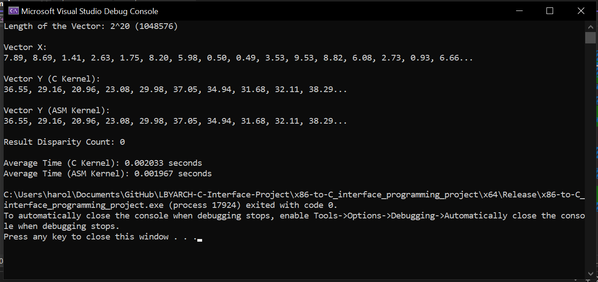
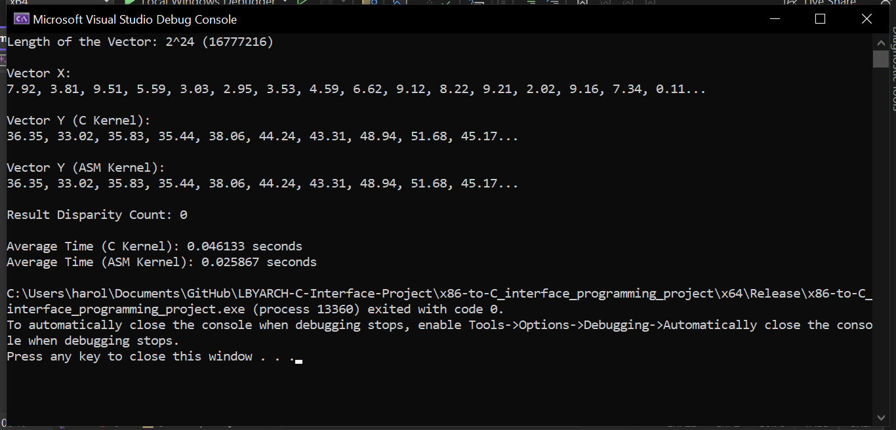
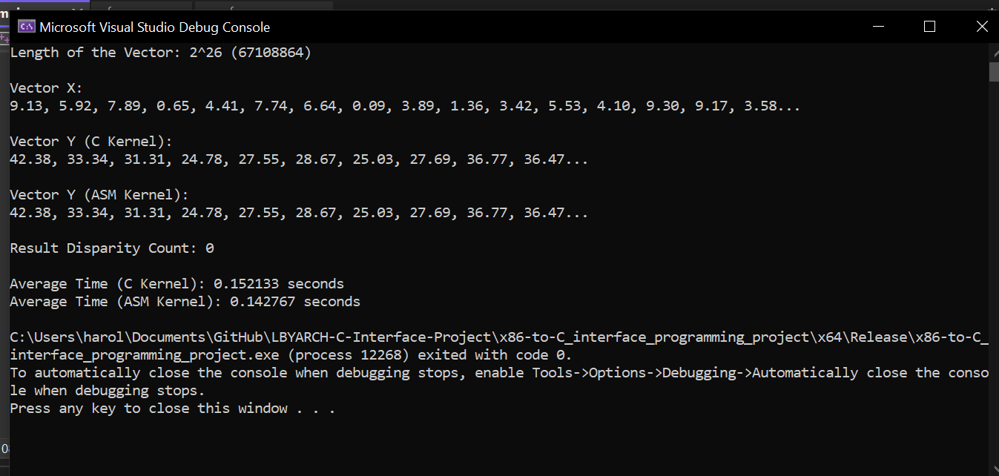

# LBYARCH Machine Project 2: x86-to-C Interface Programming
```Mojica, Harold C. | Yung Cheng, Adrian U. | S15```

This project performs a 1-dimensional stencil of a vector `X` with size `n` and places the result in a vector `Y` both in x86-64 assembly and C language. The program runs each kernel 30 times for a more distinct yield in average runtime and utilizes array sizes of 2^26 elements but will only be additionally ran at sizes 2^20 and 2^24. Higher array sizes were tested but produced inconsistent results (e.g. successful run but greatly varied average runtime, or does not run at all). 

## Machine Properties, and Specifications:
* OS: Windows 10
* System: 64-bit operating system, x64-based processor
* Processor: Intel Octa-Core i7-10510 @ 1.8-2.3GHz
* RAM: 8192 MB @ 2600 MHz

## 1-D Stencil Formula

$Y[i] = X[i - 3] + X[i - 2] + X[i - 1] + X[i] + X[i + 1] + X[i + 2] + X[i + 3]$

## Comparative Analysis

### Debug Mode
| **Vector Size**   | **C (in sec)** | **Assembly (in sec)** | **Faster** | **%**     |
|:-----------------:|:--------------:|:---------------------:|:----------:|:---------:|
| $2^{20}$          | 0.020633s      | 0.004400s             | Assembly   | 468.93%   |
| $2^{24}$          | 0.229867s      | 0.020967s             | Assembly   | 1096.33%  |
| $2^{26}$          | 0.907233s      | 0.093133s             | Assembly   | 974.13%   |

### Release Mode
| **Vector Size**   | **C (in sec)** | **Assembly (in sec)** | **Faster** | **%**     |
|:-----------------:|:--------------:|:---------------------:|:----------:|:---------:|
| $2^{20}$          | 0.002033s      | 0.001967s             | Assembly   | 103.36%   |
| $2^{24}$          | 0.046133s      | 0.025867s             | Assembly   | 178.35%   |
| $2^{26}$          | 0.152133s      | 0.142767s             | Assembly   | 106.56%   |

From the average runtimes in both debug and release mode, it can be inferred that the Assembly implementation has a better performance than the C implementation due to the consistency in difference of the average runtimes of each kernel at their respective array sizes. This can be due to the lower-level nature of the Assembly language plus its capacity to run multiple data operations using a single instruction being able to run and compute more optimally than that of the C implementation. 

## Program Output Screenshots

To ensure that both kernels are able to procure the correct results, error checking and validation was implemented. For this program, the results produced by the C implementation will be used as the basis for correctness. A counter was made to check how many disparities were present in the ASM implementation's results. The greater the number the counter has, the more errors that the latter had produced in its results, while having 0 or no errors indicates that both implementations were similar in results. 

### Debug Mode

#### $2^{20}$
</img>
#### $2^{24}$
</img>
#### $2^{29}$
</img>

### Release Mode

#### $2^{20}$
</img>
#### $2^{24}$
</img>
#### $2^{29}$
</img>